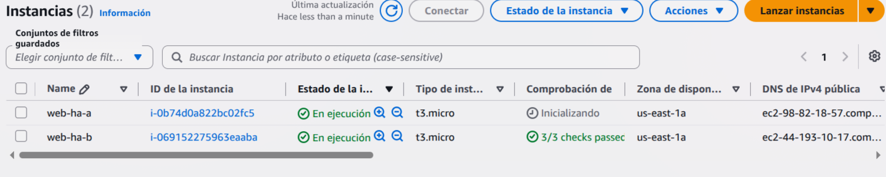
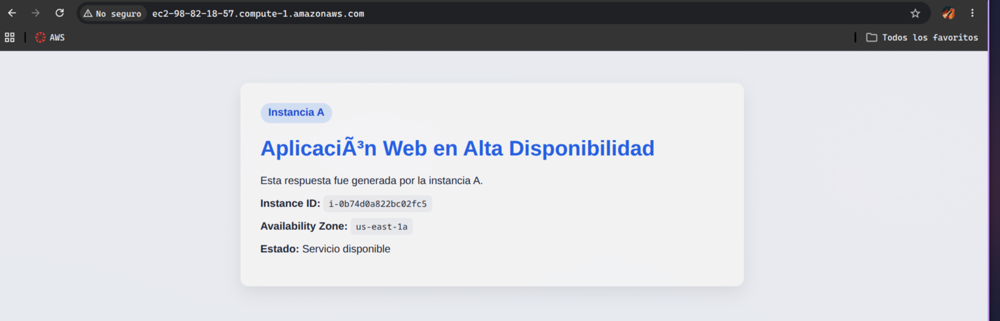
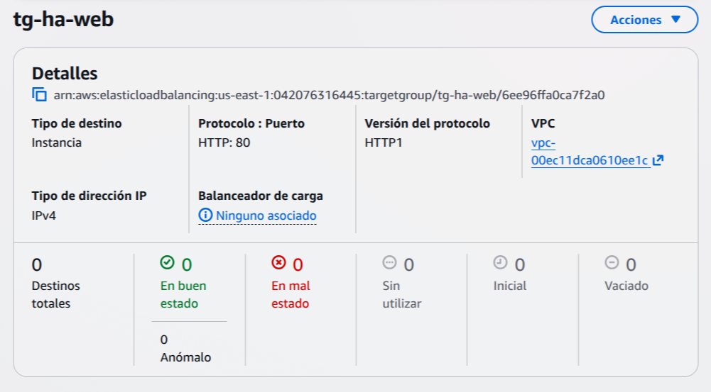
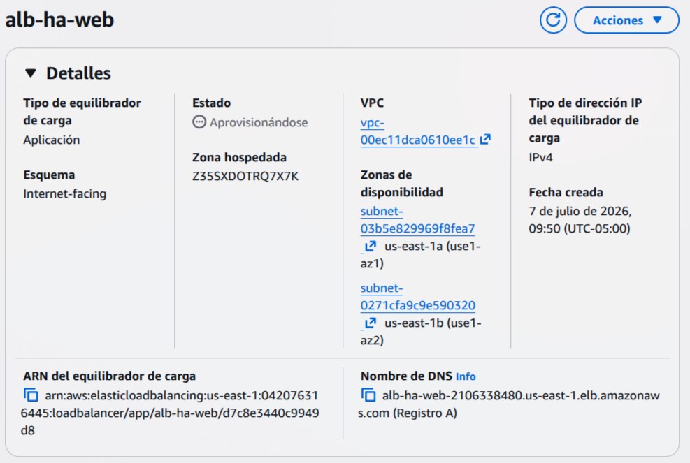
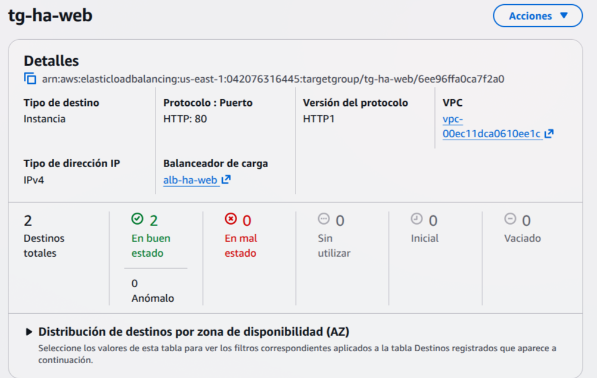
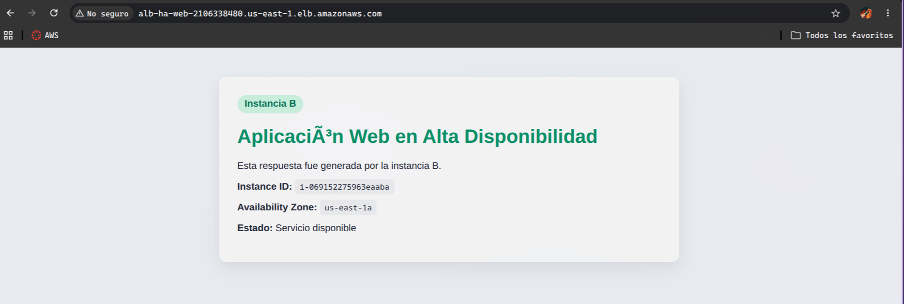
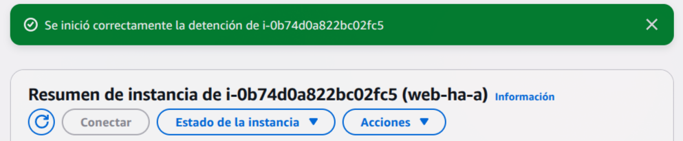
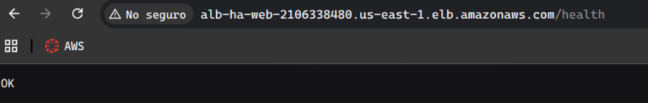

# Laboratorio de Alta Disponibilidad con AWS

Laboratorio práctico sobre alta disponibilidad usando **EC2**, **Application Load Balancer** y **Target Groups** en AWS.

---

## Arquitectura

```
       Usuario
          |
          | (DNS del ALB)
          v
  ┌─────────────────┐
  │  Application    │
  │  Load Balancer  │
  └────────┬────────┘
           |
  ┌────────┴────────┐
  │  Target Group   │
  └──┬──────────┬───┘
     |          |
     v          v
 ┌────────┐ ┌────────┐
 │ EC2 A  │ │ EC2 B  │
 │ (AZ A) │ │ (AZ B) │
 └────────┘ └────────┘
```

---

## Requisitos previos

- Cuenta de AWS con permisos para crear EC2, ALB, Target Groups y Security Groups.
- AWS CLI configurado (opcional).
- Navegador web para verificar el acceso.

---

## Recursos del laboratorio

| Archivo | Descripción |
|---|---|
| `userData.sh` | Script de bootstrap para la **Instancia A** |
| `userData2.sh` | Script de bootstrap para la **Instancia B** |
| `readme.md` | Documentación del laboratorio |
| `assets/image-*.png` | Capturas de evidencia del laboratorio |

### Scripts de bootstrap

Ambos scripts instalan **Apache (httpd)**, obtienen metadatos de la instancia (ID y AZ) mediante **IMDSv2**, y generan una página `index.html` que identifica qué instancia respondió. También crean un endpoint `/health` para los health checks.

---

## Pasos del laboratorio

### 1. Crear las instancias EC2

Lanzar dos instancias EC2 con Amazon Linux 2023, cada una en una **zona de disponibilidad distinta** (AZ A y AZ B). Asignar el script `userData.sh` a la instancia A y `userData2.sh` a la instancia B.



### 2. Verificar acceso individual

Acceder a la IP pública de cada instancia desde el navegador para confirmar que responden correctamente.



### 3. Crear el Target Group

Crear un **Target Group** que registre ambas instancias EC2 en el puerto 80 con un health check en la ruta `/health`.



### 4. Crear el Application Load Balancer

Crear un **ALB** público asociado al Target Group. El ALB distribuye el tráfico entre ambas instancias.



### 5. Verificar estado de las instancias

Confirmar que ambas instancias aparecen como **Healthy** en el Target Group.



### 6. Acceder a través del ALB

Ingresar desde el **DNS del Load Balancer**. Refrescar la página para observar cómo el balanceador alterna entre ambas instancias.



---

## Preguntas — Parte 1

1. ¿Qué instancia respondió primero?
   **R:** Depende de cuál reciba la primera solicitud; el ALB selecciona una instancia según su algoritmo de balanceo (round-robin).

2. ¿El balanceador alternó entre ambas instancias?
   **R:** Sí, al refrescar la página se observa que el ALB distribuye las solicitudes entre ambas.

3. ¿Qué información permite confirmar que hay más de una instancia activa?
   **R:** El `Instance ID` y la `Availability Zone` que muestra cada página, ya que son distintos entre una instancia y otra.

4. ¿Qué papel cumple el Target Group?
   **R:** Agrupa las instancias EC2, define el puerto de escucha y las reglas de health check. El ALB enruta el tráfico hacia las instancias registradas en el Target Group.

5. ¿Qué papel cumplen los health checks?
   **R:** Monitorean periódicamente la salud de cada instancia consultando el endpoint `/health`. Si una instancia falla, el ALB deja de enviarle tráfico hasta que se recupere.

6. ¿Por qué el usuario no necesita conocer las IP públicas de las instancias?
   **R:** Porque el ALB expone un único DNS público como punto de entrada único, ocultando la topología interna.

---

## Simulación de falla

Se detuvo la **instancia A** para simular una caída.



A pesar de la falla, el sistema sigue respondiendo desde la **instancia B** a través del balanceador.


### Preguntas — Parte 2

1. ¿Qué ocurrió cuando se detuvo la instancia A?
   **R:** El health check detectó que la instancia A dejó de responder (estado `Unhealthy`). El ALB dejó de enviarle tráfico y redirigió todas las solicitudes a la instancia B.

2. ¿El sistema completo dejó de estar disponible?
   **R:** No, la instancia B continuó respondiendo, por lo que el sistema siguió disponible.

3. ¿Qué hizo el Load Balancer cuando detectó la falla?
   **R:** Marcó la instancia como `Unhealthy` en el Target Group y desvió todo el tráfico a las instancias restantes (instancia B).

4. ¿Qué diferencia habría si solo existiera una instancia?
   **R:** El sistema habría dejado de estar disponible por completo (punto único de falla o SPOF).

5. ¿Qué atributo de calidad mejora esta arquitectura?
   **R:** La **alta disponibilidad** (availability) y la **tolerancia a fallos** (fault tolerance).

---

## Recuperación

Se volvió a levantar la **instancia A**. Ambas instancias quedan operativas nuevamente.


### Preguntas — Parte 3

1. ¿Qué ocurrió cuando la instancia A volvió a estar saludable?
   **R:** El health check la detectó como `Healthy` nuevamente y el ALB reanudó el envío de tráfico hacia ella.

2. ¿El balanceador volvió a enviarle tráfico?
   **R:** Sí, el ALB la reincorporó automáticamente al pool de instancias activas y distribuyó tráfico entre A y B nuevamente.

3. ¿Por qué es importante que la recuperación sea automática desde el punto de vista del usuario?
   **R:** Porque evita intervención manual, minimiza el tiempo de indisponibilidad y el usuario final no percibe interrupciones.

4. ¿Qué limitaciones tiene esta arquitectura si la instancia no se reinicia manualmente?
   **R:** Depende de un operador para restaurar el servicio, lo que introduce latencia humana, posible error manual, y el sistema opera con capacidad reducida hasta que alguien intervenga. En producción se resuelve con Auto Scaling.

### Tabla de componentes

| Elemento | Función en la arquitectura |
|---|---|
| EC2 instancia A | Ejecuta la aplicación web en la AZ A |
| EC2 instancia B | Ejecuta la aplicación web en la AZ B (redundancia) |
| Application Load Balancer | Distribuye el tráfico entrante entre las instancias sanas |
| Target Group | Agrupa las instancias y define las reglas de health check |
| Health Check | Monitorea el estado de cada instancia periódicamente |
| Security Group del ALB | Controla el tráfico entrante hacia el balanceador |
| Security Group de EC2 | Controla el tráfico entrante hacia las instancias |
| Zonas de disponibilidad | Aíslan las instancias físicamente para evitar puntos únicos de falla |

---

## Verificación de health checks



---

## Propuesta de mejora para producción

A partir de la arquitectura construida, proponga una versión mejorada para producción.

1. **¿Cómo agregaría recuperación automática?**
   **R:** Implementando un **Auto Scaling Group** con un mínimo de 2 instancias y alarms de CloudWatch para lanzar/reemplazar instancias automáticamente. También se puede configurar **Recovery de CloudWatch Alarm** para reiniciar instancias ante fallos de sistema.

2. **¿Cómo protegería las instancias para que no sean públicas?**
   **R:** Colocando las EC2 en **subredes privadas** y usando un **NAT Gateway** para salida a internet. Solo el ALB estaría en una **subred pública**.

3. **¿Cómo agregaría HTTPS?**
   **R:** Asociando un **certificado SSL/TLS de AWS Certificate Manager (ACM)** al ALB y redirigiendo el tráfico HTTP (puerto 80) a HTTPS (puerto 443) a nivel del balanceador.

4. **¿Cómo registraría logs y métricas?**
   **R:** Habilitando **Access Logs del ALB** en S3, configurando **CloudWatch Metrics y Alarms** para monitorear CPU y estado de health checks, y usando **AWS X-Ray** para trazado de solicitudes.

5. **¿Cómo manejaría despliegues sin caída?**
   **R:** Con **rolling updates** o **blue/green deployments** usando **CodeDeploy** y lifecycle hooks en el Auto Scaling Group para drenar conexiones antes de terminar instancias.

6. **¿Qué componentes agregaría para una base de datos altamente disponible?**
   **R:** **Amazon RDS Multi-AZ** (réplica síncrona en otra AZ) para bases relacionales, o **Amazon DynamoDB** con tablas globales para bases NoSQL.

---

## Entregables del laboratorio

El estudiante debe entregar un documento breve con:

1. Diagrama de arquitectura implementada.
2. Captura de las dos instancias EC2.
3. Captura del Target Group con targets Healthy.
4. Captura del Application Load Balancer.
5. Evidencia de respuesta desde instancia A.
6. Evidencia de respuesta desde instancia B.
7. Evidencia de falla simulada.
8. Explicación de cómo el balanceador mantiene la disponibilidad.
9. Limitaciones de la arquitectura.
10. Propuesta de mejora hacia producción.
